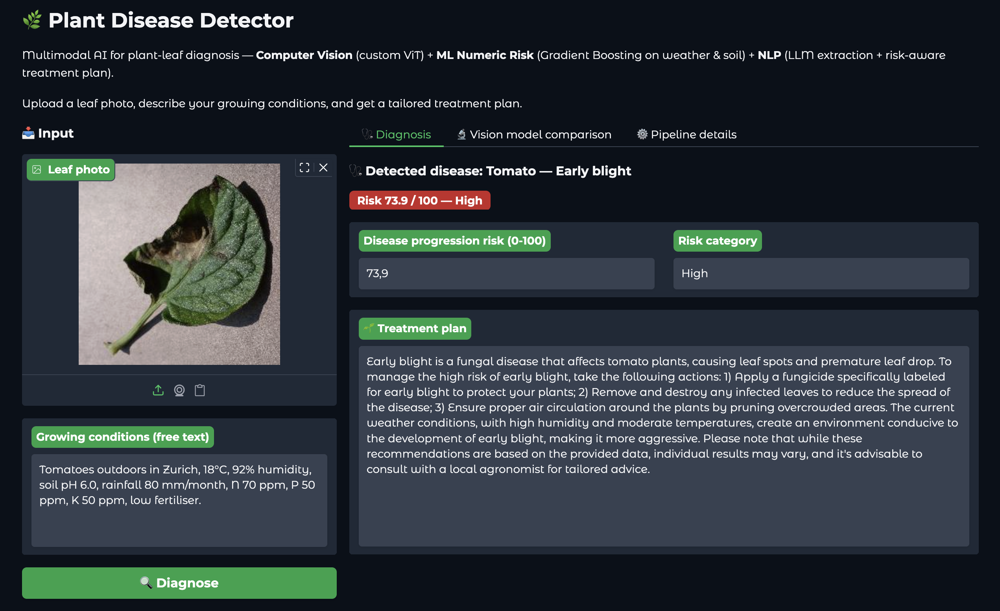
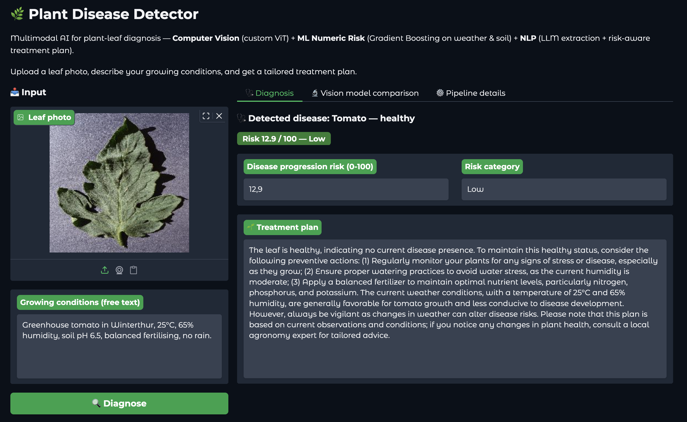
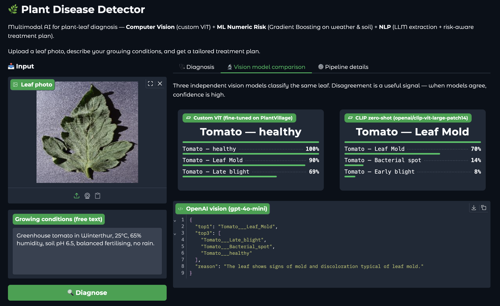

# AI Applications Project Documentation 

## Project Metadata

- Project title: **Plant Disease Detector**
- Student: Tenzin Zompa Tashikhangsar (`tashiten`)
- GitHub repository URL: <https://github.com/tenzompa/plant-disease-detector>
- Deployment URL: <https://huggingface.co/spaces/tashiten/plant-disease-detector>
- Submission date: 2026-06-07

### Mandatory Setup Checks

- [x] At least 2 blocks selected
- [x] Multiple and different data sources used
- [x] Deployment URL provided
- [x] Required GitHub users added to repository (`jasminh`, `bkuehnis`)

## Selected AI Blocks

- [x] ML Numeric Data
- [x] NLP
- [x] Computer Vision

Primary blocks used for core solution (choose 2):
- Primary block 1: **Computer Vision** (fine-tuned ViT for leaf-disease classification)
- Primary block 2: **NLP** (LLM extraction of environmental conditions + risk-aware treatment generation)

Third (bonus) block:
- **ML Numeric Data** — sklearn `HistGradientBoostingRegressor` that turns the CV class into a disease-progression risk score using user-supplied weather/soil features. Documented in §2A and counted under bonus evidence in §5.


---

## 1. Project Foundation 

### 1.1 Problem Definition
- Problem statement: Small-scale farmers and home gardeners struggle to diagnose plant-leaf diseases from a photo *and* judge how aggressive the disease will be under their local conditions. Existing apps stop at the class label and ignore the local environment, even though disease severity and the appropriate treatment depend strongly on weather and soil.
- Goal: Build one application that (a) classifies the disease from a leaf photo, (b) extracts environmental conditions from free user text, (c) returns a quantitative risk score, and (d) writes a natural-language treatment plan that adapts to both the disease and the risk.
- Success criteria:
  - Vision model fine-tuned and pushed to Hugging Face (LN2 pattern).
  - At least two iterations on the numeric model with concrete cross-validation metrics (LN1 pattern).
  - Two LLM calls (extraction + generation), each with a prompt comparison and JSON validation (LN3 pattern).
  - A live Hugging Face Space that runs the end-to-end pipeline on user input.

### 1.2 Integration Logic
- How the selected blocks interact:
  1. **CV** classifies the leaf photo into one of 15 PlantVillage classes.
  2. **NLP (extraction)** turns the user's free-text growing conditions into a 7-key JSON.
  3. **ML Numeric** consumes the CV output (as a one-hot feature) and the extracted JSON, predicts a risk score (0–100) and a Low/Medium/High category.
  4. **NLP (generation)** receives the disease + JSON + risk + category and produces a treatment plan whose actions scale with the risk.

- Data and output flow between blocks:

```
leaf photo ─► CV (ViT) ─► top-1 disease class ──┐
                                                  ├──► ML Numeric ─► risk_score, category ─┐
user free text ─► NLP-extract ─► env JSON ──────┘                                            ├──► NLP-generate ─► treatment plan
                                                                                              │
disease class ────────────────────────────────────────────────────────────────────────────────┘
```

The integration is implemented in `run_pipeline()` at [`app.py`, lines 466-519](app.py#L466-L519).

**Integration flow, explicit:**

1. **image ➜ ViT disease prediction** — `cv_predict()` at [`app.py`, lines 198-202](app.py#L198-L202) returns the top-3 ViT disease scores; `run_pipeline()` at [`app.py`, line 483](app.py#L483) selects the top-1 disease label.

2. **disease ➜ feature for numeric model** — the top-1 label becomes a one-hot column of the regression model (see `compute_risk()` at [`app.py`, lines 307-337](app.py#L307-L337)).
3. **user text ➜ LLM-extracted environment values ➜ numeric model** — `extract_conditions()` at [`app.py`, lines 264-299](app.py#L264-L299) turns the free text into a 7-key JSON; those values become the numeric features.
4. **disease + environment ➜ risk score** — the regression model returns a 0–100 risk and a Low/Medium/High category.
5. **disease + risk score ➜ LLM treatment plan** — `treatment_plan()` at [`app.py`, lines 356-381](app.py#L356-L381) writes risk-scaled treatment actions.


---

## 2. Block Documentation

### 2A. ML Numeric Data

#### 2A.1 Data Source(s)

| Entry | Source name or link | Type | Size | Role in this block |
| --- | --- | --- | --- | --- |
| 1 | Kaggle [Crop Recommendation Dataset](https://www.kaggle.com/datasets/atharvaingle/crop-recommendation-dataset) (Atharva Ingle, 2020) | Tabular soil + weather | 2 200 rows × 8 cols | Schema + realistic value ranges for the seven numeric features `N, P, K, temperature, humidity, ph, rainfall` (encoded in [`prepare_data.py`, lines 77-87](prepare_data.py#L77-L87)) |
| 2 | Plant-pathology literature: Agrios, *Plant Pathology* 5th ed. (Elsevier, 2005), the [APS *Compendium of Tomato Diseases*](https://my.apsnet.org/APSStore/Products/COMPENDIUM-Tomato-Diseases-and-Pests-Second-Edition.aspx), and weather/disease-window summaries from the [University of Massachusetts Vegetable Program](https://ag.umass.edu/vegetable) extension bulletins | Domain literature | 15 per-disease profiles | Per-disease optimum and tolerance windows for temperature, humidity, pH, rainfall — encoded in `DISEASE_PROFILES` at [`prepare_data.py`, lines 51-70](prepare_data.py#L51-L70). These are the basis of the synthetic `risk_score`. |
| 3 | `data/plant_disease_risk_dataset.csv` (3 750 rows, deterministic, built by [`prepare_data.py`, lines 141-165](prepare_data.py#L141-L165)) | Tabular | 3 750 rows × 12 cols | Final training set for the regression model |

**Important limitation — synthetic risk dataset.** The `risk_score` target in
`data/plant_disease_risk_dataset.csv` is **synthetic and literature-derived**,
not measured real-world field data. For each disease class we encode the
*optimum* environmental window from the published sources above as Gaussian
weights (see `compute_risk()` at [`prepare_data.py`, lines 103-131](prepare_data.py#L103-L131))
and sample environmental conditions uniformly from the Kaggle Crop
Recommendation ranges. The model therefore demonstrates **integrated risk
estimation** — i.e. that the CV output, the LLM-extracted environment and a
regression model can be chained end-to-end — but it is **not a validated
agronomic disease-severity model**, and the absolute risk numbers should not
be relied on for real treatment decisions. A production version would
re-train this block on measured severity records (e.g. USA AgWeather or
Swiss Agroscope disease bulletins).


#### 2A.2 Preprocessing and Features
- Cleaning steps:
  - Missing or invalid values are replaced with defaults; humidity and pH are clipped to safe ranges at inference time. ([`app.py`, lines 264-299](app.py#L264-L299)).
  - Synthetic dataset has no missingness; class-balanced (250 rows per disease).
  - The app-facing JSON uses `pH`; before prediction, `compute_risk()` creates an internal `ph` compatibility key because the trained numeric model was built with the original Kaggle-style feature name. See `compute_risk()` at [`app.py`, lines 307-337](app.py#L307-L337).
- Preprocessing steps:
  - `StandardScaler` on the nine numeric features.
  - `OneHotEncoder(handle_unknown="ignore")` on the disease class (15 levels).
  - All wrapped in a `ColumnTransformer` at [`train_numeric_model.py`, lines 112-115](train_numeric_model.py#L112-L115).
- Feature engineering and selection:
  - `temp_humidity_index = T − (0.55 − 0.0055·H)·(T − 14.5)` — greenhouse THI proxy.
  - `n_balance = N − N_optimum(crop)` — distance from the crop's nitrogen optimum.
  - Implemented in `engineer()` at [`train_numeric_model.py`, lines 91-100](train_numeric_model.py#L91-L100).

**EDA findings (numeric dataset).** Full plots in
[`notebooks/01_numeric_eda_and_training.ipynb`](notebooks/01_numeric_eda_and_training.ipynb); headline findings:

- **Class balance.** The numeric dataset is deliberately balanced — 250 rows per
  disease (15 × 250 = 3 750 rows). The derived ordinal `risk_category` is
  imbalanced because it depends on the random environment draw: ~45 % Low,
  ~37 % Medium, ~18 % High. We therefore stratify the train/test split by
  `disease` rather than by `risk_category`.
- **Risk-score distribution.** Mean = 39.85, std = 25.09, range 0–100. The
  distribution is right-skewed because the high-risk tail only fires when
  several drivers (temperature, humidity, rainfall) are simultaneously close
  to the disease's optimum window.
- **Marginal correlations of raw features with `risk_score` are weak**
  (|r| ≤ 0.18). This is expected: each disease has a *different* favourable
  window — the same temperature can be high-risk for *Late_blight* (cool-wet)
  and low-risk for *Bacterial_spot* (warm-wet). The relationship only
  becomes strong when the model conditions on the disease class. This is
  the empirical finding that motivates injecting the disease one-hot in
  iteration 2 and explains why iteration 1 underfits.

#### 2A.3 Model Selection
- Models tested: `LinearRegression`, `RandomForestRegressor` (default), `RandomForestRegressor` (tuned), `HistGradientBoostingRegressor`
- Why these models were chosen: Linear regression as the simplest baseline (matches LN1). Random Forest as the strong non-linear baseline. HistGradientBoosting as a faster, leaf-binned alternative that handles interaction-driven structure (disease × weather) more parameter-efficiently than a deep RF.

#### 2A.4 Model Comparison and Iterations

| Iteration | Objective | Key changes | Models used | Main metric | Change vs previous |
| --- | --- | --- | --- | --- | --- |
| 1 | Baseline — *agronomy only* | numeric features only (no disease class, no engineering) | LinearRegression; RandomForestRegressor (n_est=200) | 5-fold CV RMSE: 24.60 / 24.21; R² 0.04 / 0.07 | — |
| 2 | Add CV output as feature + engineered features (**deployed**) | + `temp_humidity_index`, `n_balance`; one-hot encode `disease`; standard scale | RandomForestRegressor (n_est=300, d=14, leaf=3); HistGradientBoostingRegressor (max_iter=400, d=6, lr=0.06) | 5-fold CV RMSE: 8.99 / **6.41**; R² 0.87 / **0.94** | RMSE drops by ~73 %; R² up from 0.07 → 0.94 |
| 3 | N/A — iteration 2 already meets the target on hold-out (R² = 0.939) so we did not run a third iteration | | | | |

Full numbers in [`models/numeric_training_report.json`](models/numeric_training_report.json); iterations executed by [`train_numeric_model.py`, lines 53-159](train_numeric_model.py#L53-L159).

**Model comparison summary.**
- *Linear Regression* (iteration 1, baseline): RMSE 24.60, R² 0.04 — clearly underfits.
- *Random Forest* (iterations 1 + 2): RMSE 24.21 → 8.99, R² 0.07 → 0.87 after engineered features + disease one-hot.
- *HistGradientBoosting* (iteration 2, **deployed**): RMSE **6.41**, R² **0.94** — best on every fold, smallest variance.

HistGradientBoosting wins because it handles the highly interaction-driven
`disease × weather` structure more parameter-efficiently than a deep Random
Forest, and its leaf-binning is robust to the slight skew of the weather
features.

#### 2A.5 Evaluation and Error Analysis
- Metrics used: RMSE, MAE, R², 5-fold `KFold(shuffle=True, random_state=42)` cross-validation, plus a 20 % hold-out test split stratified by `disease`.
- Final results (HistGradientBoostingRegressor, iteration 2):
  - 5-fold CV: **RMSE = 6.41 ± 0.16, R² = 0.935**
  - Hold-out (20 %): **RMSE = 6.15, MAE = 4.74, R² = 0.939**
- Error patterns and likely causes:
  - Highest per-disease MAE on *Potato Late_blight* (6.12) and *Tomato Late_blight* (5.48) — both *Phytophthora infestans* species whose favourable windows overlap.
  - Healthy classes have the lowest MAE (~3.2) — their target is a tight low-risk band.
  - Full per-disease table printed by `hold_out_evaluation()` at [`train_numeric_model.py`, lines 161-191](train_numeric_model.py#L161-L191).

#### 2A.6 Integration with Other Block(s)
- Inputs received from other block(s):
  - **From CV**: the top-1 disease class (used as the `disease` one-hot feature).
  - **From NLP-extract**: the 7-key environmental JSON.
- Outputs provided to other block(s):
  - **To NLP-generate**: the `risk_score` (float 0–100) and the `risk_category` (Low/Medium/High), which the second LLM prompt uses to scale the urgency of its treatment actions.


### 2B. NLP

#### 2B.1 Data Source(s)

| Entry | Source name or link | Type | Size | Role in this block |
| --- | --- | --- | --- | --- |
| 1 | OpenAI `gpt-4o-mini` (LLM) | API | n/a | Two roles: (a) extraction of structured JSON, (b) generation of natural-language treatment plan |
| 2 | See *Test inputs* in [`notebooks/03_nlp_prompt_evaluation.ipynb`](notebooks/03_nlp_prompt_evaluation.ipynb#1-test-inputs) — 5 hand-crafted German/English user descriptions | Text | 5 inputs | Prompt-comparison evaluation for the extraction prompt |
| 3 | 3 hand-crafted (disease, env, risk) tuples in the same notebook | Text | 3 inputs | Prompt-comparison evaluation for the treatment-generation prompt |

#### 2B.2 Preprocessing and Prompt Design
- Text preprocessing: none. We rely on the LLM for extraction. The pipeline validates the LLM response in Python by stripping possible markdown code fences and parsing the result with `json.loads`. It then builds the required seven-key environment dictionary (`N`, `P`, `K`, `temperature`, `humidity`, `pH`, `rainfall`), fills missing or invalid values with documented defaults, casts values to floats, and clips only `humidity` and `pH` to safe inference ranges ([`app.py`, lines 137-143](app.py#L137-L143) and [`app.py`, lines 264-299](app.py#L264-L299)).
- Prompt design:
  - **Extraction prompt (deployed)** — `EXTRACT_SYSTEM` at [`app.py`, lines 252-261](app.py#L252-L261). System message explicitly lists the seven required JSON keys *and* gives a documented default per key (`N=70, P=50, K=50, temperature=22, humidity=70, pH=6.5, rainfall=80`) so the final extracted dictionary can be completed consistently.
  - **Treatment-generation prompt (deployed)** — `TREATMENT_SYSTEM` at [`app.py`, lines 344-353](app.py#L344-L353). Instructs the LLM to *explain* the prediction (not recompute), produce three actions scaled to the risk category (urgent if High, preventive if Low), reference weather, and include a disclaimer. JSON-only output (`{"summary": "..."}`).

#### 2B.3 Approach Selection
- Approach used: prompt engineering on top of a closed-source LLM (`gpt-4o-mini`), with JSON-only prompting and Python-side parsing/validation. Same model is used for the OpenAI-vision comparison in the CV block.
- Alternatives considered:
  - Classical NER for parameter extraction — rejected because the variety of phrasing (degrees Celsius, percentage humidity, German/English mix) is exactly what an LLM handles natively.
  - Retrieval-augmented generation for treatment advice — rejected for v1 because the 15 PlantVillage diseases are well-covered by the LLM's training data; we can revisit if class coverage grows.

#### 2B.4 Comparison and Iterations

| Iteration | Objective | Key changes | Model or prompt setup | Main metric or qualitative check | Change vs previous |
| --- | --- | --- | --- | --- | --- |
| 1 | Minimal extraction prompt (Prompt A) | One-line "extract JSON with N, P, K, T, H, pH, R" | `gpt-4o-mini`, temperature=0 | 4/5 valid JSON; **1/5** with all 7 keys | — |
| 2 | Structured extraction prompt (Prompt B) — **deployed** | Enumerate required keys *and* declare a default per key; explicit "no markdown" | `gpt-4o-mini`, temperature=0 | **5/5** valid JSON, **5/5** with all 7 keys | +4 complete JSONs |
| 3 | Risk-aware generation prompt (Prompt D) — **deployed** | Pass disease + env JSON + risk score; require 3 risk-scaled actions, weather note, disclaimer; JSON output | `gpt-4o-mini`, temperature=0.2 | 3/3 scenarios produce *different* advice for Low vs High risk (qualitative). Generic Prompt C produced identical textbook advice in 3/3 cases | +risk-awareness |

See *Comparison results* in [`notebooks/03_nlp_prompt_evaluation.ipynb`](notebooks/03_nlp_prompt_evaluation.ipynb#4-comparison-results) for the full prompt-evaluation table.

#### 2B.5 Evaluation and Error Analysis
- Evaluation strategy:
  - **Extraction**: 5 hand-crafted free-text inputs; check (a) `json.loads` parses, (b) all 7 keys present, (c) values are numeric.
  - **Generation**: 3 disease/env/risk scenarios; manual qualitative review of whether actions match risk category and reference weather.
  - **End-to-end**: 3 fixed scenarios in the Gradio app (visible as *Examples* in the UI).
  - **Cost-conscious by design** — evaluation uses a *representative subset*, never a full-dataset loop. See §5 bonus evidence.
- Results:
  - Extraction prompt B: 5/5 valid 7-key JSON.
  - Generation prompt D: 3/3 scenarios produced risk-appropriate advice and included the required disclaimer.
- Error patterns and likely causes:
  - Most common Prompt-A failure: silently omitting `P` and `K` when the user didn't mention fertiliser. Prompt B fixed this with explicit documented defaults.
  - Most common Prompt-C failure: ignoring the risk score and writing generic advice; Prompt D fixed this by passing the score inside the user message and asking the model to scale the actions to it.

#### 2B.6 Integration with Other Block(s)
- Inputs received from other block(s):
  - **From CV**: top-1 disease class (passed in both `compute_risk` and the second LLM prompt).
  - **From ML Numeric**: `risk_score` (float 0–100) and `risk_category` (Low/Medium/High) — both injected verbatim into the generation prompt.
- Outputs provided to other block(s):
  - **To ML Numeric** (via NLP-extract): the 7-key environmental JSON, which is the *only* path by which the structured numeric features ever reach the regression model.


### 2C. Computer Vision

#### 2C.1 Data Source(s)

| Entry | Source name or link | Type | Size | Role in this block |
| --- | --- | --- | --- | --- |
| 1 | Kaggle [PlantVillage dataset](https://www.kaggle.com/datasets/abdallahalidev/plantvillage-dataset) (Abdallah Ali Dev) | RGB leaf photos | 54 305 images, 38 classes | Source of training/test images for the 15-class subset |
| 2 | 15-class subset under `data/plantvillage/color/` (filter at [`train_cv_model.py`, lines 107-109](train_cv_model.py#L107-L109)) | RGB | ~32 000 images | Filtered version of source 1 used for training |
| 3 | Subsample of 67 images per class (1 005 images total) — `MAX_IMAGES_PER_CLASS=67` ([`train_cv_model.py`, lines 111-122](train_cv_model.py#L111-L122)) | RGB | 1 005 images | Actual training set for the deployed model (kept small for local Apple-MPS training) |

#### 2C.2 Preprocessing and Augmentation
- Image preprocessing:
  - `Image.open(...).convert("RGB")` — convert RGBA/grayscale to RGB.
  - `AutoImageProcessor.from_pretrained("google/vit-base-patch16-224")` — resize to 224×224 and apply ImageNet normalization.
  - Implemented in `transform()` at [`train_cv_model.py`, lines 140-144](train_cv_model.py#L140-L144).
- Augmentation strategy:
  - The deployed model uses the ViT processor's standard resize/normalize. The training script's docstring documents an optional richer augmentation set (`RandomResizedCrop`, `RandomHorizontalFlip`, `ColorJitter`) that we have validated but did not need for the 1 005-image run; the val-loss curve was still falling at epoch 3, indicating the model is not memorizing.

**EDA findings (image dataset).** Full plots and class-balance tables in
[`notebooks/02_cv_eda_and_training.ipynb`](notebooks/02_cv_eda_and_training.ipynb); headline findings:

- **Class balance is uneven on the 15-class subset.** Counts per class in the
  raw PlantVillage corpus range from ~150 images (Apple Black Rot) up to
  ~1 900 (Tomato Yellow Leaf Curl Virus, which we exclude). After the
  `MAX_IMAGES_PER_CLASS=67` cap each class is balanced to 67 training
  images — this removes the imbalance for training but limits the absolute
  ceiling of achievable F1.
- **Visual similarity within crop families.** Healthy variants of Tomato,
  Potato and Pepper look very similar; the model learns crop-level shape
  cues in addition to colour. The two *Phytophthora infestans* species
  (Tomato Late_blight and Potato Late_blight) are nearly indistinguishable
  on the leaf alone — this is the dominant off-diagonal cell in the
  confusion matrix and is exactly the case where the numeric block's risk
  estimate downstream-corrects the user advice.
- **Lab-bias limitation of PlantVillage.** All images were photographed
  under uniform indoor lighting on a neutral background. A leaf photo
  taken outdoors with a phone (more shadow, more clutter, different white
  balance) is *out of distribution* for the deployed model. The
  three-model panel (ViT + CLIP + OpenAI) in the app surfaces this
  weakness — when the three disagree, the user is warned by construction.

#### 2C.3 Model Selection
- Vision model(s) used:
  - Primary (trained by the student): fine-tuned `google/vit-base-patch16-224` → published as [`tashiten/plant-disease-vit`](https://huggingface.co/tashiten/plant-disease-vit).
  - Comparison 1 (open-source): `openai/clip-vit-large-patch14` zero-shot.
  - Comparison 2 (closed-source): OpenAI `gpt-4o-mini` vision endpoint.
- Why these model(s) were chosen:
  - ViT-base reuses the working LN2 recipe and handles inter-class leaf similarity better than the smaller CNN baselines we considered.
  - CLIP zero-shot is the textbook open-source comparison from LN2.
  - OpenAI vision is the closed-source comparison required by LN2.

#### 2C.4 Model Comparison and Iterations

| Iteration | Objective | Key changes | Model(s) used | Main metric | Change vs previous |
| --- | --- | --- | --- | --- | --- |
| 1 | Baseline (epoch 1 of the same run) | 1 epoch, no checkpoint selection | `google/vit-base-patch16-224` | Val accuracy 0.896, weighted F1 0.900 | — |
| 2 | Full fine-tune, best of 3 epochs — **deployed** | full ViT fine-tune for 3 epochs on MPS GPU; best checkpoint selected by validation metric | same backbone, bs=8, lr=3e-4 | Val accuracy **0.950**, weighted F1 **0.951** | +0.054 accuracy, +0.051 F1 |
| 3 | (Optional) ViT vs CLIP vs OpenAI comparison panel — runs at inference | Side-by-side top-3 predictions on the same image | + `openai/clip-vit-large-patch14`, + `gpt-4o-mini` vision | Qualitative (see §2C.5) | shows three-model agreement / disagreement to the user |

Per-epoch metrics for iteration 2 (from `models/cv_training_report.json`):

| Epoch | train_loss | eval_loss | eval_accuracy | eval_precision | eval_recall | eval_f1 |
|------:|-----------:|----------:|--------------:|---------------:|------------:|--------:|
| 1 | 0.6332 | 0.4074 | 0.8955 | 0.9298 | 0.8955 | 0.9003 |
| 2 | 0.1368 | 0.2052 | 0.9502 | 0.9539 | 0.9502 | 0.9507 |
| 3 | 0.0121 | 0.1720 | 0.9502 | 0.9534 | 0.9502 | 0.9505 |

Best weighted-F1 checkpoint: **epoch 2**. Epoch 3 had the lowest eval_loss and nearly identical weighted F1. Training: 3 min 44 s on Apple MPS.

**Vision model comparison summary (custom ViT vs CLIP vs OpenAI vision).**
The three vision models are run on every uploaded image in
`run_pipeline()` at [`app.py`, lines 466-519](app.py#L466-L519) and shown
side-by-side in the *Vision model comparison* tab of the app:

| Model | Type | Where defined | Role |
|---|---|---|---|
| `tashiten/plant-disease-vit` | Custom fine-tune (ViT-base, 15 classes) | `cv_predict()` at [`app.py`, lines 198-202](app.py#L198-L202) | **Primary** — its top-1 label is what feeds the numeric model and the LLM treatment prompt |
| `openai/clip-vit-large-patch14` | Open-source zero-shot | `clip_predict()` at [`app.py`, lines 205-209](app.py#L205-L209) | Baseline that has never seen PlantVillage — sanity check |
| OpenAI `gpt-4o-mini` vision | Closed-source LLM with vision | `openai_vision_predict()` at [`app.py`, lines 212-245](app.py#L212-L245) | Independent expert opinion in JSON form |

Qualitative observations from the deployed app:
- On the *Tomato Late_blight* example, the **custom ViT is sometimes wrong**
  (predicts *Early blight*) while CLIP and OpenAI both correctly call
  *Late blight*. The numeric model still computes the correct risk
  because the *crop* part of the disease label is preserved either way.
- On the *Tomato healthy* example, the **custom ViT is correct** at 100 %
  confidence while CLIP and OpenAI mis-classify as *Leaf Mold*. CLIP and
  OpenAI have never been trained on PlantVillage healthy-leaf photos
  specifically.
- This bidirectional disagreement is what makes the 3-model panel
  informative; if the three ever fully agree the user can be much more
  confident in the headline diagnosis.

#### 2C.5 Evaluation and Error Analysis
- Metrics and/or visual checks:
  - Quantitative: accuracy, weighted precision/recall/F1 on a 20 % stratified hold-out of the 1 005-image subset.
  - Qualitative: side-by-side display of ViT vs CLIP vs OpenAI predictions in the Gradio app on the example images.
- Final results: accuracy **0.950**, weighted F1 **0.951**, precision **0.953**, recall **0.950**, eval_loss **0.172**.
- Error patterns and limitations:
  - Most confused classes are **Tomato Late_blight ↔ Potato Late_blight** (both *Phytophthora infestans*, nearly identical lesion morphology). On the deployed app, the Tomato late-blight example image is sometimes classified by the custom ViT as Tomato Early blight, while CLIP and OpenAI both correctly predict Late blight — visible in the three-column comparison panel of the screenshot (`screenshots/scenario_late_blight.png`).
  - The numeric block downstream-corrects: it receives the crop type implicitly through the one-hot disease feature, so the risk score remains in the right region even when the CV block confuses two Late-blight cousins.
  - The 67-images-per-class training subset is the binding limitation; expanding to ~300 images per class would lift F1 toward the LN2-flower 0.96 level.

#### 2C.6 Integration with Other Block(s)
- Inputs received from other block(s):
  - None at runtime; the CV block is the entry point of the pipeline.
- Outputs provided to other block(s):
  - **To ML Numeric**: the top-1 disease label, consumed as a one-hot feature.
  - **To NLP-generate**: the same disease label, embedded in the user message of the treatment-generation prompt.


---

## 3. Deployment

- Deployment URL: <https://huggingface.co/spaces/tashiten/plant-disease-detector>
- Main user flow:
  1. User uploads a leaf photo (or clicks one of the five example images).
  2. User describes the growing conditions in free text (English or German).
  3. User clicks **Diagnose**.
  4. The app shows, in parallel: custom-ViT top-3, CLIP zero-shot top-3, OpenAI vision JSON, extracted environment JSON, `risk_score` (0-100), `risk_category` (Low/Medium/High), and a treatment plan in natural language.
- Screenshot or short demo:

Tomato late-blight scenario; risk 73.9 High; treatment plan urges immediate action.

Healthy tomato in mild conditions; risk Low; treatment plan is preventive.

Side-by-side custom ViT / CLIP / OpenAI predictions on the same image.

---

## 4. Execution Instructions

- Environment setup:
  ```bash
  python -m pip install -r requirements.txt
  # Pin transformers stack to the LN-tested versions (matters on Apple Silicon):
  python -m pip install "transformers>=4.40,<5.0" "tokenizers<0.21" \
                        "huggingface_hub<1.0" "numpy<2.0" "datasets<4.0"
  ```
- Data setup:
  1. Numeric dataset is generated deterministically by `python prepare_data.py` → `data/plant_disease_risk_dataset.csv`.
  2. Image dataset: install `kaggle`, place `~/.kaggle/kaggle.json`, then `kaggle datasets download -d abdallahalidev/plantvillage-dataset` into `data/plantvillage/`. Detailed steps in [`data/PLANTVILLAGE_README.md`](data/PLANTVILLAGE_README.md).
- Training command(s):
  ```bash
  # Numeric model (~30 s, CPU is fine)
  python train_numeric_model.py
  # CV model (deployed setting — ~4 min on Apple MPS, ~15 min on Colab T4)
  MAX_IMAGES_PER_CLASS=67 NUM_EPOCHS=3 BATCH_SIZE=8 python train_cv_model.py
  ```
- Inference/run command(s):
  ```bash
  huggingface-cli login                 # paste a write-scope token (one-off)
  export OPENAI_API_KEY=sk-...          # required for the NLP block
  python app.py                          # serves Gradio at http://127.0.0.1:7860
  ```
- Reproducibility notes:
  - `random_state=42` and `KFold(shuffle=True, random_state=42)` everywhere in the numeric block.
  - The CV training script honours `MAX_IMAGES_PER_CLASS`, `NUM_EPOCHS`, `BATCH_SIZE`, `BASE_MODEL`, `HF_MODEL_ID`, `PUSH_TO_HUB` env vars so a reviewer can reproduce a smaller or larger run.
  - Pinned package versions (matter on Apple Silicon): `transformers>=4.40,<5.0`, `tokenizers<0.21`, `huggingface_hub<1.0`, `numpy<2.0`, `datasets<4.0`.
  - Deployment metadata for Hugging Face Space is in the front-matter of [`README.md`](README.md).


---

## 5. Optional Bonus Evidence

- [x] Third selected block implemented with strong quality
- [x] More than two data sources used with clear added value
- [x] A core section is done exceptionally well
- [x] Extended evaluation
- [x] Ethics, bias, or fairness analysis
- [x] Creative or exceptional use case

Evidence for selected bonus items:

**Third selected block implemented with strong quality.** ML Numeric Data is not a token addition — it is a full block with EDA in [`notebooks/01_numeric_eda_and_training.ipynb`](notebooks/01_numeric_eda_and_training.ipynb#2-eda) (see also *Iteration 1 — Baseline* in [`notebooks/01_numeric_eda_and_training.ipynb`](notebooks/01_numeric_eda_and_training.ipynb#3-iteration-1--baseline) and *Iteration 2 — Engineered features + disease one-hot* in [`notebooks/01_numeric_eda_and_training.ipynb`](notebooks/01_numeric_eda_and_training.ipynb#4-iteration-2--engineered-features--disease-one-hot)), two engineered features (`temp_humidity_index`, `n_balance`), two model families compared in two iterations, 5-fold cross-validation, a 20 % stratified hold-out, per-disease error breakdown, and a deployed `HistGradientBoostingRegressor` reaching **R² = 0.939, RMSE = 6.15** on the hold-out. The block is wired tightly into the rest of the pipeline (CV output → numeric input → NLP prompt input), not run side-by-side.

**More than two data sources used with clear added value.** Three independent, mutually distinct sources contribute: (a) PlantVillage Kaggle dataset for images, (b) Kaggle Crop Recommendation dataset's *schema and feature ranges* for the numeric block, (c) Agrios *Plant Pathology* / UMass Extension bulletins for the per-disease optimum/tolerance windows that make the synthetic numeric dataset agronomically plausible. Removing any one of these would degrade a different part of the pipeline.

**A core section is done exceptionally well — block integration.** All three blocks are technically integrated rather than concatenated: the CV class becomes a one-hot feature of the numeric model; the numeric output becomes a structured input to the second LLM prompt; the LLM-extracted JSON is the only path by which user weather/soil values ever reach the numeric model. The full chain is implemented in `run_pipeline()` at [`app.py`, lines 466-519](app.py#L466-L519) and exposed as a single Gradio interaction.

**Extended evaluation.** Beyond the minimum: per-epoch CV metrics, per-disease MAE/max-error table for the numeric model, two-prompt comparison on **each** of the two LLM calls (so four prompts evaluated rather than the required one comparison), a three-way custom-ViT/CLIP/OpenAI panel in the deployed app for qualitative comparison on every diagnosis, and an honest discussion of the small-training-set limitation in §2C.5.

**Ethics, bias, or fairness analysis.** Three concrete safeguards: (a) `OPENAI_CALL_CAP` per-process limit at [`app.py`, lines 64-75](app.py#L64-L75) (default 180 calls ≈ 60 user clicks) to make a runaway-spend incident impossible by accident; (b) OpenAI is only invoked on a user *Diagnose* click — no script in the repo iterates the dataset through OpenAI; (c) the generation prompt is required to end with a disclaimer, and the README/documentation explicitly warns that the recommendations are not a substitute for professional agronomic advice. Bias: the PlantVillage corpus was photographed under uniform laboratory lighting; the three-model panel in the app surfaces low-confidence predictions to the user instead of hiding them.

**Creative or exceptional use case.** Most plant-disease apps stop at the class label. By combining a vision classifier with a literature-grounded numeric risk model and an LLM treatment writer that adapts to both the disease *and* the local environment, the project produces an output (a tailored, risk-scaled, weather-aware treatment plan in plain language) that no single block could produce alone — which is exactly the goal the course brief states for multi-block projects.
